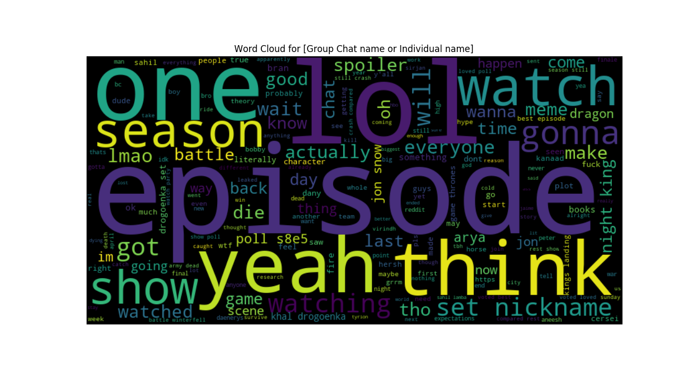
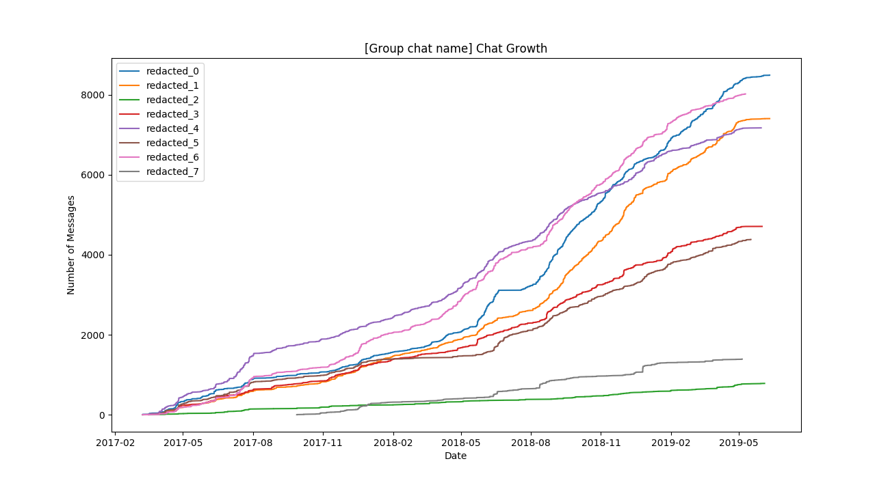
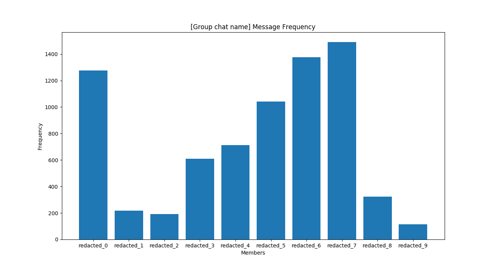

# FacebookMessageAnalysis

## Data Source
To ensure privacy, all data will be stored locally on your personal computer. Furthermore, all tools will be run locally with no network connection required.

To gather Facebook data in order to run these tools, follow these steps:
1. Go to https://www.facebook.com/settings?tab=your_facebook_information
2. Click on "Download Your Information"
3. Toggle Format to JSON (default is HTML). JSON format is needed for these tools.
4. (Optional) Uncheck any pieces of unneeded information if you are not interested. The only source important for these tools are "Messages"
5. Press Create File & wait until Facebook notifies you that the file is ready. The file will last for a few days.

## Examples

  

   

   

## List of Tools
1. Sender Frequency: Plots the frequency of messages per user in a group chat.

2. Word Cloud: Constructs a word cloud without common words for either:
    1. Group chats/1-1 chats: Accumulation of words for all messages for all users. 
    2. Personal: Accumuluation of words sent by the user for all messages across all chats.

3. Group Chat Growth: Plots the number of messages vs time for each member
of the group chat. Shows how the growth is over time per member.

## Quick Dive
### Installation
Install both matplotlib and wordcloud:

`pip install matplotlib`

`pip install wordcloud`

### Tools
* `<path-to-fb-data>`: location of the downloaded facebook data folder (after extraction).
* `<chat-folder>`: directory containing messages for a specific chat. This may sometimes be difficult to find. As a general rule of thumb, it will be the lowercase chat name with some suffix. Run, `find <path-to-fb-data>/messages/<chat-name>_*` if having difficulty finding the appropriate directory.
* `<name>`: full name of the user as appears on Facebook.

#### Sender Frequency
1. Usage: `python3 frequency_sender.py <path-to-fb-data>/messages/<chat-folder>/message.json`
    1. Note: Add the `-s` flag to shorten names to first names.
2. More information: `python3 frequency_sender.py --help`

#### Word Cloud
1. Usage:
    1. Group chats/1-1 chats:  `python3 word_cloud.py -F <path-to-fb-data>/messages/<chat-folder>/message.json`
    2. Personal: `python3 word_cloud.py -D <path-to-fb-data>/messages/inbox/ <name>`
2. More information: `python3 word_cloud.py --help`

#### Group Chat Growth
1. Usage: `python3 chat_growth.py <path-to-fb-data>/messages/<chat-folder>/message.json`
2. More information: `python3 chat_growth.py --help`

## Contributing
This project is at the very beginning stages. Feel free to add any more cool tools or add functionality to the existing tools.
Make sure to update the Installation requirements with any new libraries. In the future, a `requirements.txt` file will be suitable.

## Credits
* https://github.com/amueller/word_cloud
* https://www.washingtonpost.com/news/the-intersect/wp/2018/03/27/heres-how-to-download-all-your-data-from-facebook-it-might-be-a-wake-up-call/
